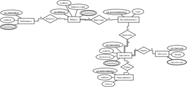
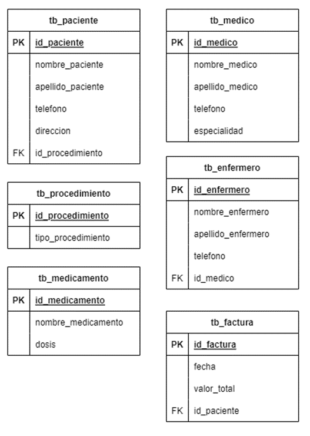
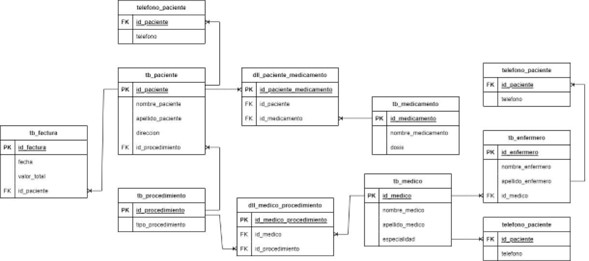

# Procedimiento médico – grupo #3
## Entidades
Las entidades identificadas para darle solución a la problemática del procedimiento médico son las siguientes:
- Paciente.
- Médico.
- Procedimiento.
- Enfermero.
- Medicamento.
- Factura.
### Condiciones
El paciente ya asistió a una cita de valoración para que se le asignara un procedimiento, y se le recetó una fórmula médica para tomar medicamentos.
La clínica se especializa en procedimientos de cirugías en general.
## Relaciones
Estas entidades se relacionan a través de los verbos que se listan a continuación.
- Asistir.
- Realizar (el Médico Realiza un procedimiento, al Paciente se le Realiza un procedimiento).
- Pagar.
- Tomar.

## Modelo entidad relación E-R

*Figura 1 MER.* (Ver **PDF** para mayor resolución) 

## Transformación a modelo relacional M-R
Para realizar la transformación desde ER a MR, se realizan los pasos a continuación.
1. Se transforman las entidades del modelo relacional en tablas con sus respectivos atributos y se realiza la primera transformación de relaciones (1:N o N:1).

*Figura 2 Primera transformación.*

2. Se transforman las relaciones M:N y los atributos multivaluados en tablas

*Figura 3 Segunda transformación.*

## Normalización
- **1FN**

    Se cumple con la separación en atributos atómicos, lo cual se visualiza en la imagen anterior, además los atributos dependen únicamente de la clave primaria 
    de cada tabla. Todo esto con el fin de eliminar los valores repetidos en la BD.
- **2FN**

    Luego de cumplir con la primera forma normal, se crea la relación entre tablas con sus respectivas claves foráneas, es decir, clave ajena.
- **3FN**

    Se crean tablas de detalle a causa de la relación muchos a muchos:
    * Tabla detalle entre paciente y medicamento.
    * Tabla detalle entre médico y procedimiento.
## Resultado de normalización
No fue necesario realizar algún cambio después de hacer las transformaciones iniciales, por lo que el resultado final se puede apreciar en la Figura 3.
## Registro de información
- Paciente.
    - id_paciente: 1144046696
    - nombre_paciente: Efrain
    - apellido_paciente: Solorzano
    - direccion: Cr 55 # 48 -40
- Médico.
    - id_medico: 47775545
    - nombre_medico: Laura
    - apellido_medico: Arrieta
    - especialidad: Cardiólogo
- Procedimiento.
    - id_procedimiento: 543543543
    - tipo_procedimiento: Operación corazón abierto
- Enfermero.
    - id_enfermero: 6737673
    - nombre_enfermero: Juan
    - apellido_enfermero: Gaviria
- Medicamento.
    - id_medicamento: cd878767867
    - nombre_medicamento: Acetaminofén
    - dosis: 100 unidades
- Factura.
    - id_factura: 8701F
    - fecha: 08/02/2023
    - valor_total: 15000
